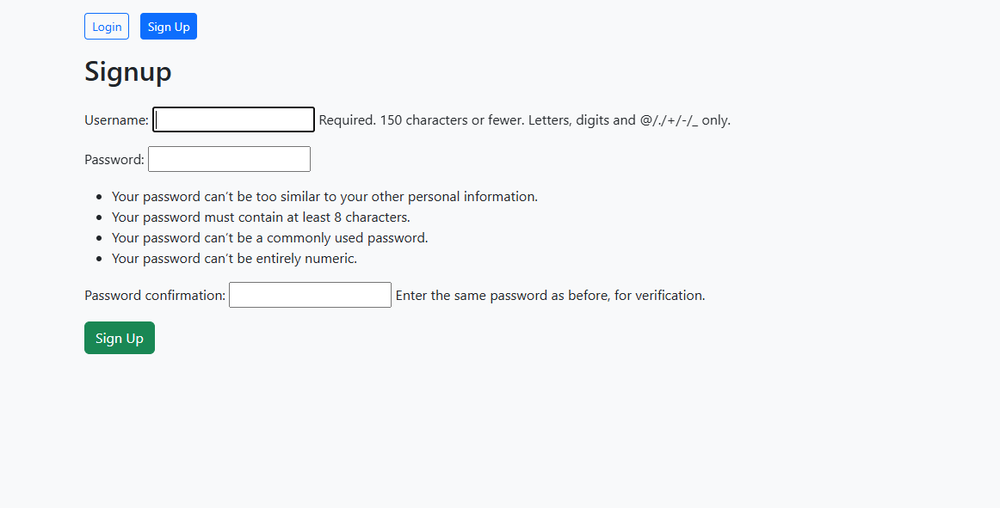
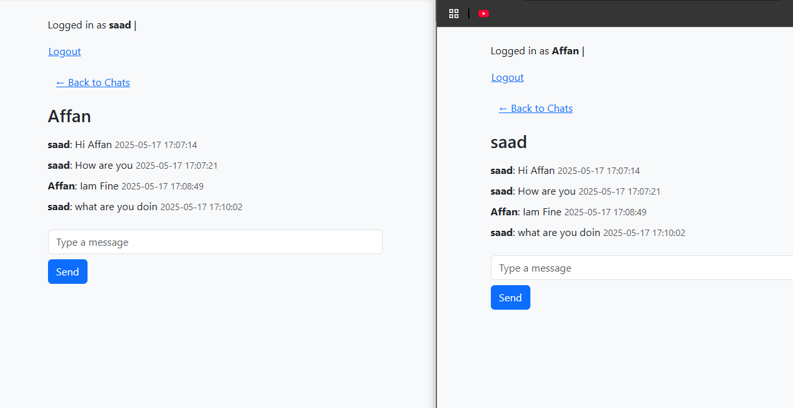

# 🗨️ TeamChat – Real-Time Django Chat Platform

---

## ✨ Features

| Core Features                      | Bonus Features                        |
|-----------------------------------|---------------------------------------|
| 🔐 User login, logout, registration | ✅ Unread message badges              |
| 💬 One-on-one and group chats      | ✅ Typing-indicator (WebSocket-ready) |
| ⚡ Real-time messaging              | 🧹 Message delete/edit (TODO)         |
| 🗂 Chat history with DB persistence | 🔍 Search (placeholder UI)           |
| 🎨 Bootstrap 5 Responsive UI       | 🌙 Dark-mode ready                    |
| 🔒 Secure CSRF & WebSocket auth    | 🚀 Docker & Render deploy setup      |

---

## 📸 Screenshots

**Login Page**


**Login Page**



**Chat Dashboard**


**Real-Time Messaging**




## 🛠️ Tech Stack

- **Python 3.11**
- **Django 5.2.1**
- **Django Channels 4**
- **Bootstrap 5**
- **SQLite (local)** / **PostgreSQL (Render)**
- **Redis (Upstash - prod channel layer)**
- **Docker + Daphne + Gunicorn**

---

## ⚙️ How to Run Locally

### 1. Clone and set up environment
```bash
git clone https://github.com/Saad-SYEDK/TeamChat
cd teamchat
python -m venv venv
source venv/bin/activate
```

### 2. Install requirements
```bash
pip install -r requirements.txt
